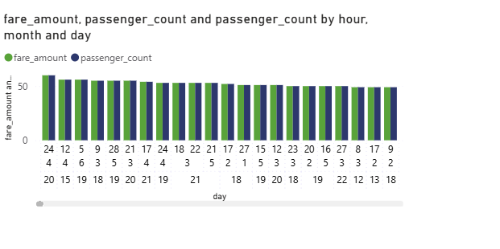

# Python_and_Power_BI_ass
# 🚖 Uber Fares Data Analysis Using Python & Power BI

## 📌 Introduction
This project aims to analyze the Uber Fares dataset using Python and Power BI. The objective is to uncover meaningful insights into fare patterns, ride behavior, and operational metrics. An interactive Power BI dashboard was created to visually explore the dataset and identify trends that could help improve ride-sharing services and business strategy.

---

## ⚙️ Methodology

### 📁 Data Collection
- **Dataset Source**: Uber Fares dataset from Kaggle
- **Data Format**: CSV
- **Initial Size**: 200,000 records with pickup/drop-off coordinates, fare amounts, datetime, and passenger counts.

### 🔎 Data Processing
- **Step 1**: Loaded the dataset in Python using `pandas`.
- **Step 2**: Cleaned missing values and ensured datetime and coordinate formatting.
- **Step 3**: Performed Exploratory Data Analysis (EDA) including statistical summaries, outlier detection, and visualizations.
- **Step 4**: Feature Engineering to extract new variables such as:
  - Hour, Day, Month
  - Weekday names
  - Peak/Off-peak indicators
  - Ride distance (using geopy)
- **Step 5**: Saved the cleaned and enriched dataset as `uber_enhanced.csv` for import into Power BI.

---

## 📊 Analysis

### Descriptive Statistics
- **Average Fare**: $11.36
- **Median Fare**: $8.50
- **Most Frequent Fare**: $6.50
- **Fare Range**: $0.01 to $196.00
- **Outliers**: Over 17,000 outlier fares identified using IQR method.

### Visual Analysis in Power BI
- **Fare Distribution**: Histograms and boxplots revealed right-skewed fare values.

- **Fare vs Distance**: Positive correlation observed — longer distances generally resulted in higher fares.
- **Hourly, Daily, and Monthly Trends**: 
  - Ride demand peaks during **morning (7–9 AM)** and **evening (5–7 PM)**.
  - **Fridays and Saturdays** had the highest number of rides.
  - Rides are lower during late-night hours and early mornings.

    

### Temporal Insights
- **Seasonal and Monthly Variation**: Traffic increases in warmer months.
- **Weekday vs Weekend Patterns**: Business rides more common on weekdays, leisure rides on weekends.

  

### Geospatial Insights
- Most pickups are concentrated in **New York City’s central zones**.
- High fare pickups cluster around airports and business districts.

---

## 📌 Results

- **Peak Hours Identified**: 7–9 AM and 5–7 PM on weekdays.
- **Busiest Weekdays**: Friday followed by Saturday.
- **High Fare Zones**: Airport routes and central Manhattan.
- **Distance** is a strong driver of fare amount but has variability based on traffic or route efficiency.

---

## ✅ Conclusion

The analysis successfully extracted valuable operational insights from the Uber Fares dataset. By using both Python for preprocessing and Power BI for visual storytelling, the project bridges data cleaning, exploration, and interactive visualization effectively.

---

## 💡 Recommendations

1. **Optimize driver availability during peak hours** using ride frequency data.
2. **Promote discounts during low-demand hours** to balance traffic.
3. **Enhance routing algorithms** to improve ride efficiency and reduce costs.
4. **Monitor high-fare zones** for potential demand-based pricing strategies.
5. **Incorporate weather data in future** for even richer modeling of fare dynamics.

---

## 📁 Repository Structure

